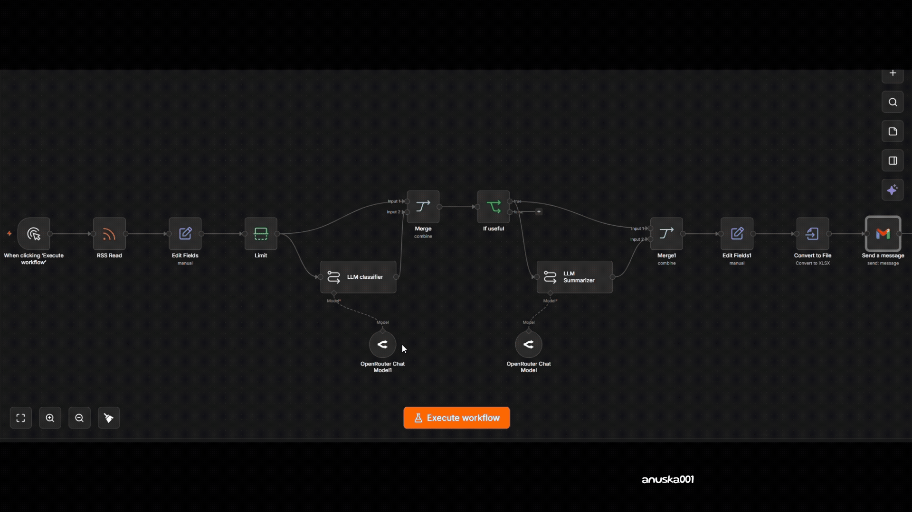

# n8n-reddit-brief
## What it does?
This automated n8n workflow collects weekly top discussions from Product Management Reddit communities, uses AI to first categorize them into useful / not useful posts and then summarizes the useful discussions, and sends a readable digest to your Gmail. 

## Demo

## How to use it?
1. Import the n8n workflow JSON (n8n-reddit-brief.json) into your n8n workflow canvas.
2. Connect your **OpenRouter**/**OpenAI** credentials for the LLM.
3. Connect your **Gmail** account.
4. Activate the workflow.
5. Change the trigger as you prefer so that the workflow will automatically run on its configured schedule and send the Reddit Digest to your Gmail inbox.

> This project was built and tested using a local n8n setup.
